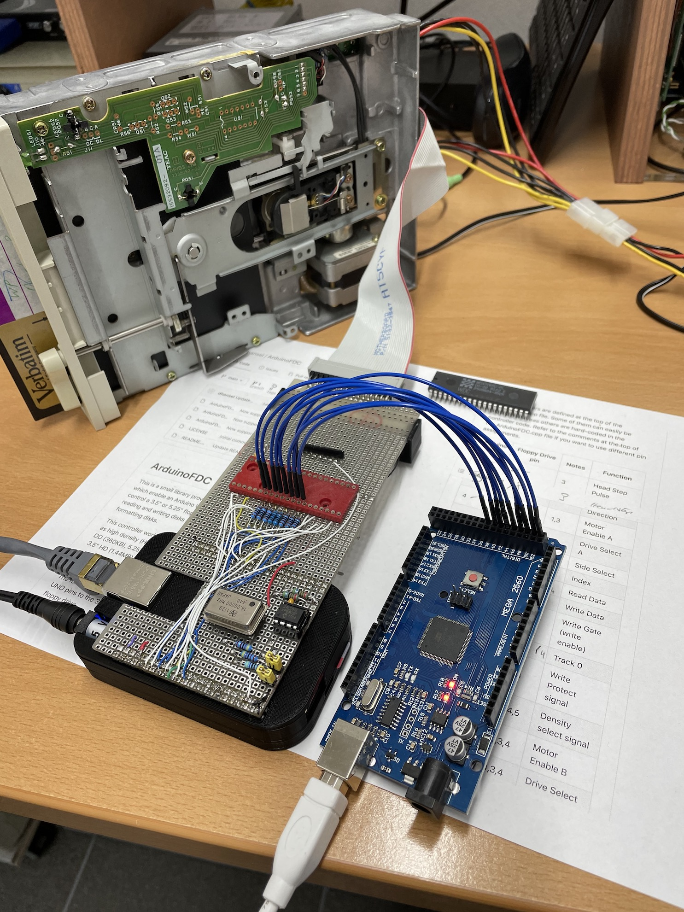

# bbb-fdc
Use a BBB to connect to WD37C65C as FDC inspired by Scott Baker's [pi-fdc](https://github.com/sbelectronics/pi-fdc)

Why use a BeagleBoneBlack board?

Well, firstly, I had one. Secondly, it has more and more versatile IO then any Raspberry. GPIO access from userspace is fast with about 2.x MHz pin toggling. And if required, two PRU controllers can be initialized to shift high speed IO to dedicated hardware RT processing units. 

Using [cyclic test](git.kernel.org/pub/scm/linux/kernel/git/clrkwllms/rt-tests.git) it became obvious, RT is apparently better choice over Xenomai RT kernel.

```
Linux beaglebone 4.19.94-ti-rt-r61 #1buster SMP PREEMPT RT Wed Mar 31 15:22:19 
UTC 2021 armv7l GNU/Linux
markus@beaglebone:~/rt-tests$ sudo ./cyclictest -m -S 95
policy: other/other: loadavg: 1.80 1.65 0.72 1/128 2516
T: 0 ( 2516) P: 0 I:1000 C:  25643 Min:     30 Act:  141 Avg:  129 Max:    4174
```

```
Linux beaglebone 4.19.94-ti-xenomai-r61 #1buster SMP PREEMPT Wed Mar 31 16:37:22 UTC 2021 armv7l GNU/Linux
markus@beaglebone:~/rt-tests$ sudo ./cyclictest -m -S 95
policy: other/other: loadavg: 4.89 1.91 0.69 1/97 2480
T: 0 ( 2480) P: 0 I:1000 C:  12854 Min:     95 Act:  104 Avg:  197 Max:    4384
```

```
Linux beaglebone 4.19.94-ti-r61 #1buster SMP PREEMPT Wed Mar 31 15:23:20 UTC 2021 armv7l GNU/Linux
# /dev/cpu_dma_latency set to 0us
policy: other/other: loadavg: 0.04 0.04 0.07 1/200 3357
T: 0 ( 3357) P: 0 I:1000 C:  12147 Min:     74 Act:   80 Avg:  135 Max:    6333
```

Not to forget the amazing BBBio_lib that allows port access to a number of initialized pins. So reading and writing bytes to a (data) port does not get any easier. And in contrast to wiringPi, pin numbering scheme is not counter intuitive.

Still, for being useable with Python extensions the Makefile is to be adapted to build a shared library and not only statics.


```
all : libiobb.so
libiobb.so : ${LIB_PATH}BBBiolib.c ${LIB_PATH}BBBiolib.h BBBiolib_PWMSS.o BBBiolib_McSPI.o BBBiolib_ADCTSC.o i2cfunc.o
	gcc -shared -fPIC -c ${LIB_PATH}BBBiolib.c -o ${LIB_PATH}BBBiolib.o
	gcc -shared -fPIC -o ${LIB_PATH}libiobb.so ${LIB_PATH}BBBiolib.o ${LIB_PATH}BBBiolib_PWMSS.o ${LIB_PATH}BBBiolib_McSPI.o ${LIB_PATH}BBBiolib_ADCTSC.o ${LIB_PATH}i2cfunc.o
	cp ${LIB_PATH}libiobb.so ./
	#ldconfig
	cp ${LIB_PATH}BBBiolib.h ./iobb.h
	cp ${LIB_PATH}BBBiolib_ADCTSC.h ./
	cp ${LIB_PATH}BBBiolib_McSPI.h ./
	cp ${LIB_PATH}BBBiolib_PWMSS.h ./
	cp ${LIB_PATH}i2cfunc.h ./
install :
	#cp ${LIB_PATH}libiobb.a /usr/local/lib
	cp ${LIB_PATH}libiobb.so /usr/local/lib
```
The electrical part looks as follows. It is meant as cape prototype (even has an eeprom).
Image actually shows a test setup to check read/write routines for 8 data lines. 



